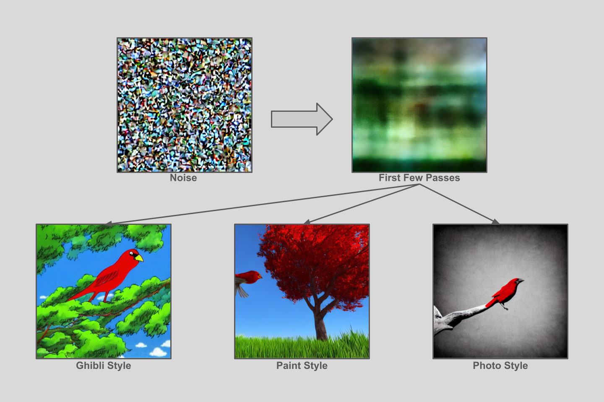

# Generative AI with Stable Diffusion: From Basics to Web App


This repository contains a hands-on journey into Generative AI using the Stable Diffusion model — from fundamental concepts to building real-world applications.

Originally designed as a 5-week structured learning course, the project now also demonstrates how AI-generated visual content can be used for social media marketing, branding, and content automation.

By the end of this project, you'll not only understand how diffusion models generate images from text prompts but also how to fine-tune, customize, and deploy them in a Streamlit web app for creative tasks like:
- Generating branded visuals and memes for marketing campaigns
- Producing consistent themed imagery for social platforms
- Experimenting with styles, prompts, and LoRA fine-tuning to match brand aesthetics

The repository includes Jupyter notebooks covering model fundamentals, fine-tuning, and pipeline customization — culminating in a functional web app that can serve as a content-generation tool for social media marketing teams or individual creators.


## Table of Contents
- [Key Technologies](#key-technologies)
- [Prerequisites](#prerequisites)
- [Setup and Installation](#setup-and-installation)
- [Repository Structure](#repository-structure)
  - [Week 1: Environment Variable Management](#week-1-environment-variable-management)
  - [Week 2: Understanding Stable Diffusion](#week-2-understanding-stable-diffusion)
  - [Week 3: Fine-Tuning with LoRA](#week-3-fine-tuning-with-lora)
  - [Week 4: Building a Streamlit Web App](#week-4-building-a-streamlit-web-app)
  - [Week 5: Customizing the Generation Pipeline](#week-5-customizing-the-generation-pipeline)
- [How to Run](#how-to-run)
- [License](#license)

## Key Technologies
- **Python**
- **PyTorch**: For deep learning and tensor operations.
- **Hugging Face**:
  - `diffusers`: For working with diffusion models like Stable Diffusion.
  - `transformers`: For text tokenization and embedding.
  - `datasets`: For loading data from the Hugging Face Hub.
  - `huggingface-hub`: For programmatic interaction with the Hub.
- **Streamlit**: For building the interactive web application.
- **`python-dotenv`**: For managing environment variables and secrets.
- **Pillow (PIL)**: For image manipulation.

## Prerequisites
- Python 3.8+
- `git` for cloning the repository.
- **A CUDA-enabled GPU is highly recommended for Weeks 2-5**, as running these notebooks on a CPU will be extremely slow. The code includes checks to fall back to CPU, but performance will be severely impacted.

## Setup and Installation

1.  **Clone the repository:**
    ```bash
    git clone https://github.com/your-username/generative-ai-stable-diffusion.git
    cd generative-ai-stable-diffusion
    ```

2.  **Create a virtual environment (recommended):**
    ```bash
    python -m venv venv
    source venv/bin/activate  # On Windows, use `venv\Scripts\activate`
    ```

3.  **Install the required dependencies:**
    A `requirements.txt` file has been created based on the imports in the notebooks.
    ```bash
    pip install -r requirements.txt
    ```

4.  **Set up the environment file:**
    For the Week 1 notebook, you will need a `.env` file. A sample is provided below. Create a file named `.env` in the root directory:
    ```env
    # .env
    DATASET_NAME="sample-dataset"
    SECRET_KEY="some-secret-value"
    ```

## Repository Structure

The repository is organized by week, with each folder containing the relevant notebook and any associated files.

### Week 1: Environment Variable Management
- **File:** `week1_dotenv.ipynb`

This notebook introduces the importance of managing configuration and sensitive data (like API keys) using environment variables.

**Key Concepts:**
- Using the `python-dotenv` library to load variables from a `.env` file.
- Accessing environment variables in Python with `os.environ`.
- Programmatically setting and unsetting keys in the `.env` file using `set_key()` and `unset_key()`.
- Common pitfalls, such as forgetting to reload the `.env` file, using spaces in keys, and ensuring values are strings.
- Gracefully handling missing keys using `os.environ.get()` to prevent `KeyError`.

### Week 2: Understanding Stable Diffusion
- **Files:** `week2a_diffusion_from_scratch.ipynb`, `week2b_diffusion_pipeline.ipynb`

This week is split into two parts to provide a deep dive into the Stable Diffusion architecture.

**Part A: Building from Scratch**
- This notebook deconstructs the Stable Diffusion pipeline to show how each component works.
- **Key Concepts:**
  - **Text Embeddings**: Converting a text prompt into a numerical representation using the CLIP Tokenizer and Text Encoder.
  - **Latent Space**: Generating initial random noise in the latent space.
  - **VAE (Variational Auto-Encoder)**: Decoding latent vectors into viewable images.
  - **U-Net and Scheduler**: The core denoising process, where the U-Net model predicts noise at each timestep, and the scheduler uses this prediction to refine the latent vector.
  - **Classifier-Free Guidance**: Combining a conditioned (prompt-guided) and unconditioned (empty prompt) noise prediction to improve prompt adherence.

**Part B: Using the `StableDiffusionPipeline`**
- This notebook demonstrates how to use the high-level `StableDiffusionPipeline` from the `diffusers` library to abstract away the complexity.
- **Key Concepts:**
  - Generating images with a single function call.
  - Controlling image generation with parameters like `guidance_scale` and `num_inference_steps`.
  - Prompt engineering techniques, including adding style keywords to influence the output.

### Week 3: Fine-Tuning with LoRA
- **File:** `week3_lora_finetuning.ipynb`

This notebook focuses on customizing the Stable Diffusion model to generate images of a specific subject (a dog named Maya) using Low-Rank Adaptation (LoRA).

**Key Concepts:**
- Loading image datasets from the Hugging Face Hub using the `datasets` library.
- Understanding the theory behind LoRA for efficient, parameter-light fine-tuning.
- Using a pre-provided script (`train_text_to_image_lora.py`) to perform the fine-tuning.
- Loading the trained LoRA weights into a standard Stable Diffusion pipeline to generate images of the custom subject.

### Week 4: Building a Streamlit Web App
- **Files:** `week4_streamlit_app.ipynb`, `meme_app/app.py`, `meme_app/arial.ttf`

This notebook guides the development of a complete web application that uses the fine-tuned model from Week 3 to generate memes.

**Key Concepts:**
- Structuring a Python project for a Streamlit application.
- Building a UI with Streamlit widgets like `st.sidebar`, `st.number_input`, `st.text_area`, and `st.button`.
- Using the Pillow library to draw text on generated images.
- Caching expensive resources (like the Stable Diffusion model) with `@st.cache_resource` to improve app performance.
- Running and interacting with a local Streamlit server.

### Week 5: Customizing the Generation Pipeline
- **File:** `week5_customizing_diffusion.ipynb`

This final notebook focuses on refactoring the image generation logic into a flexible, reusable function that exposes more of Stable Diffusion's power to the end-user.

**Key Concepts:**
- Creating a modular `generate_images` function that accepts parameters for `guidance_scale`, `num_inference_steps`, and `style`.
- Using a dictionary to map user-friendly style names (e.g., 'anime', 'photo') to detailed prompt additions.
- Integrating this enhanced function into a Streamlit application to give users more creative control.

## How to Run

- **Jupyter Notebooks**:
  Navigate to the respective weekly folder and open the `.ipynb` file in Jupyter Lab or Jupyter Notebook. Execute the cells in order.
  ```bash
  jupyter lab
  ```

- **Streamlit Application (Week 4 & 5):**
  After completing the `app.py` file, run the application from the terminal. Make sure you are in the `meme_app` directory or provide the correct path.
  ```bash
  # Navigate to the app's directory
  cd meme_app

  # Run the streamlit app
  streamlit run app.py
  ```
  The application will be available at a local URL displayed in your terminal (usually `http://localhost:8501`).

## License
This project is licensed under the MIT License. See the [LICENSE](LICENSE) file for details.